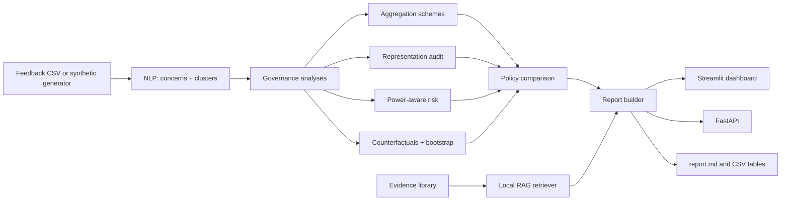

# CurriculumGuard

**A Responsible-AI governance toolkit that tests whether apparent consensus on an educational-AI policy survives once you account for who participated and whose concerns are underrepresented.**

Inspired by the question posed in the paper *"Who Controls the Curriculum for AI?"* (see [References](#references)).

> **Data notice:** the bundled dataset is **synthetic** (simulated people). Results in this README demonstrate the *method*, not real stakeholder opinion. Population shares and policy-exposure values are editable **assumptions**.
 
---

## Table of contents
1. [Research question](#research-question)
2. [What it does](#what-it-does)
3. [Architecture](#architecture)
4. [Quick start](#quick-start)
5. [Input data format](#input-data-format)
6. [Methodology](#methodology)
7. [Demo results](#demo-results)
8. [Project structure](#project-structure)
9. [Dashboard, API and CLI](#dashboard-api-and-cli)
10. [Testing and validation](#testing-and-validation)
11. [Configuration](#configuration)
12. [Limitations and ethics](#limitations-and-ethics)
13. [Roadmap](#roadmap)
14. [References](#references)

---

## Research question

> Does the apparent consensus about an educational AI policy remain the same when we account for **who participated** and whose concerns may be **underrepresented**?

Simple voting treats every response equally, so whoever participates most sets the outcome. CurriculumGuard treats the **aggregation method** as the object of study and reports how sensitive the result is to it.

## What it does

| Capability | Description |
|---|---|
| Stakeholder feedback | Students, teachers, parents, administrators, plus student subgroups (multilingual, disability) |
| NLP analysis | Lexicon-based concern extraction (accessibility, privacy, academic integrity, language access, teacher workload); TF-IDF or sentence-embedding clustering with silhouette and seed-stability scores |
| Aggregation schemes | Majority, stakeholder-balanced, population-proportional, severity-weighted |
| Representation audit | Participation vs assumed population share per group; subgroup audit with k-anonymity suppression (n < 5) |
| Concern retention | How many of each group's top concerns survive in the aggregate top concerns |
| Power-aware risk | Ranks concerns by prevalence, severity and the group's voice deficit; flags high-impact concerns of underrepresented groups |
| Counterfactuals | "What if students were 45% of participants?", sweeps, and **flip thresholds** (smallest participation change that changes the winner) |
| Uncertainty | Stratified bootstrap confidence intervals and win frequencies |
| Policy comparison | Open vs constrained vs restricted: support and unaddressed-concern burden per scheme. **Never declares a best policy** |
| Evidence layer | Local TF-IDF retrieval over `evidence/`, hit@k self-check, citations in the report |
| Interfaces | Streamlit dashboard, FastAPI service, CLI report generator, Dockerfile, pytest suite |

## Architecture



## Quick start

Requires Python 3.10+ (developed and tested on 3.12; also installs on 3.14).

```bash
git clone <your-repo-url>
cd curriculumguard
pip install -r requirements.txt

python run_pipeline.py            # generates data, writes outputs/report.md + CSVs
python -m pytest -q               # 9 tests
python -m streamlit run app.py    # dashboard at http://localhost:8501
python -m uvicorn api:app --reload  # API docs at http://127.0.0.1:8000/docs
```

> **Windows tip:** if `pytest`, `streamlit` or `uvicorn` are "not recognized", run them through `python -m ...` as above (pip user installs are often not on PATH).

**Docker**
```bash
docker build -t curriculumguard .
docker run -p 8501:8501 curriculumguard                      # dashboard
docker run -p 8000:8000 curriculumguard uvicorn api:app --host 0.0.0.0 --port 8000   # API
```

**Optional: better clustering**
```bash
pip install sentence-transformers
python run_pipeline.py --embed     # falls back to TF-IDF if unavailable
```

## Input data format

CSV with these columns:

| column | required | values |
|---|---|---|
| `group` | yes | `student`, `teacher`, `parent`, `admin` |
| `stance` | yes | `open`, `constrained`, `restricted` |
| `text` | yes | free-text feedback |
| `severity` | yes | 1 to 5 (how strongly the person is affected or concerned) |
| `subgroup` | no | `multilingual`, `disability`, `none` (students) |
| `gold_concerns` | no | `\|`-joined labels, enables extractor precision/recall |

```bash
python run_pipeline.py --csv path/to/feedback.csv
```
Or upload the CSV in the dashboard sidebar.

## Methodology

**Aggregation.** Each participant gets a weight; weights sum to 1; the policy with the highest weighted share wins.

| Scheme | Weight of participant *i* in group *g* |
|---|---|
| Majority | 1 / N (every response equal) |
| Balanced | (1 / G) / n_g (every group equal total weight) |
| Population-proportional | p_g / n_g, where p_g is the group's assumed community share |
| Severity-weighted | proportional to reported severity |

Equal group weight is a *normative choice*, which is why several schemes are shown side by side.

**Representation ratio** = participation share / population share. Under 0.75 is flagged *under*, over 1.25 *over*.

**Power-aware risk** for a (group, concern) pair:

```
risk = prevalence x (mean severity / 5) x voice_deficit
voice_deficit = clip(population share / participation share, 0.25, 5)
high_impact = severity >= 4 AND prevalence >= 25% AND group underrepresented
```

**Concern retention.** For each group, the fraction of its top-3 concerns that appear in the aggregate top-3 under a given scheme.

**Counterfactual.** Set one group to a chosen share of total weight; other groups keep their relative participation. The **flip threshold** scans shares from 0 to 1 and returns the nearest share at which the winner changes.

**Uncertainty.** Stratified bootstrap (resample within each group) gives 95% intervals on each policy's share and how often each policy wins.

**Privacy.** Subgroup counts below 5 are suppressed (k-anonymity style).

**Clustering quality.** Cosine silhouette score plus mean adjusted Rand index across random seeds as a stability measure.

**Policy comparison.** For each scheme, unaddressed-concern burden = sum over concerns of (weighted prevalence x severity/5 x policy exposure). Exposure is an editable assumption matrix in `cg/policy.py`. The output is descriptive; no policy is ranked as correct.

## Demo results

Synthetic data, 300 participants, seed 42, with deliberately skewed participation (students 20%, teachers 40%, parents 25%, admins 15% vs assumed community shares of 50 / 15 / 30 / 5).

| Scheme | Open | Constrained | Restricted | Winner |
|---|---|---|---|---|
| Majority | 22.3% | 32.7% | 45.0% | restricted |
| Balanced | 24.5% | 37.2% | 38.2% | restricted (near tie) |
| Population-proportional | 34.5% | 32.1% | 33.4% | **open** |
| Severity-weighted | 24.8% | 33.9% | 41.4% | restricted |

Flip thresholds (majority baseline: restricted):
- Students would need about **50.5%** of participants (currently 24%) to flip to *open*.
- Teachers dropping to about **14.5%** (currently 38%) flips to *constrained*.
- Admins rising to about **32.5%** (currently 13%) flips to *constrained*.

**Takeaway:** the headline outcome is not stable across aggregation rules; it depends on whose participation is counted and how. Clustering (TF-IDF, k=5): silhouette 0.21, stability ARI 0.40, which is modest, as expected for short templated text. Retrieval hit@2 on concern queries: 100%.

A second file (`test_feedback.csv`, seed 7) shows the contrast case where "constrained" wins under every scheme, i.e. the outcome is robust.

## Project structure

```
curriculumguard/
├── app.py                 # Streamlit dashboard (7 tabs)
├── api.py                 # FastAPI: /health /analyze /counterfactual /retrieve
├── run_pipeline.py        # CLI: writes outputs/report.md + CSVs
├── requirements.txt
├── Dockerfile
├── cg/
│   ├── synth.py           # synthetic generator with gold concern labels
│   ├── nlp.py             # extraction, extractor P/R/F1, clustering
│   ├── governance.py      # schemes, audits, risk, counterfactuals, bootstrap
│   ├── policy.py          # policy comparison + exposure assumptions
│   ├── rag.py             # local retriever + hit@k check
│   ├── report.py          # markdown governance report
│   └── pipeline.py        # end-to-end orchestration
├── evidence/              # starter evidence notes (replace with vetted sources)
├── tests/test_governance.py
├── data/                  # generated feedback.csv
└── outputs/               # generated report and tables
```

## Dashboard, API and CLI

**Dashboard tabs:** Representation, Concerns & clusters, Majority vs balanced, Counterfactual, Policies, Evidence, Report (with download).

**API**
| Endpoint | Purpose |
|---|---|
| `GET /health` | liveness check |
| `POST /analyze` | full analysis on posted `records` (or the default dataset) |
| `POST /counterfactual` | `{"group": "student", "share": 0.45}` returns the winner and shares |
| `GET /retrieve?q=privacy&k=2` | evidence search |

**CLI outputs:** `outputs/report.md`, `schemes.csv`, `audit.csv`, `power.csv`, `flips.csv`, `policy.csv`, `extractor_eval.csv`.

## Testing and validation

```bash
python -m pytest -q
```
The 9 tests cover weight normalisation, majority-vs-balanced divergence on a toy example, counterfactual monotonicity and exact flip thresholds, representation flags, extractor behaviour, subgroup suppression, bootstrap consistency, and an end-to-end smoke test including retrieval hit rate.

For real deployments, also: hand-label 100 to 200 comments and report extractor agreement (ideally with two labelers and inter-annotator agreement), and validate the exposure matrix with domain experts.

## Configuration

| What | Where |
|---|---|
| Community population shares | `DEFAULT_POP` in `cg/governance.py` |
| Student subgroup shares | `SUBPOP` in `cg/governance.py` |
| Policy-exposure assumptions | `EXPOSURE` in `cg/policy.py` |
| High-impact thresholds | `min_sev`, `min_prev` in `power_risk` |
| Suppression threshold | `k` in `subgroup_audit` |
| Concern lexicon | `LEXICON` in `cg/nlp.py` |
| Evidence library | add `.md` files to `evidence/` |

## Limitations and ethics

- **Synthetic data.** Demo findings are illustrative and partly circular by design; do not present them as evidence about real communities.
- **Assumed shares.** Population shares and policy exposure are assumptions and strongly affect results.
- **Lexicon extraction** is fragile on informal or multilingual text. Extractor scores on synthetic data are optimistic because templates match the lexicon.
- **Small subgroups** have wide uncertainty; counts under 5 are suppressed to reduce re-identification risk.
- **Equal weighting is normative.** Which scheme is "right" is a value judgment; the tool exposes sensitivity and does not make that choice.
- **Evidence notes** are starter summaries and must be verified and replaced with primary sources. They are not legal advice.
- **Decision support only.** Outputs should inform a human, participatory governance process, never replace it.

## Roadmap
- Real-data ingestion with consent and anonymisation workflow
- Sentence-embedding concern classifier with inter-annotator validation
- More stakeholder groups and intersectional subgroups
- Ordinal / ranked-choice ballots and additional social-choice rules
- Retrieval evaluation on a labelled query set and dense retrieval
- Deliberation-stage features (comment threads, revision tracking)

## References

**Inspiration**
1. *Who Controls the Curriculum for AI?* (the research paper motivating this project). *Add full citation: authors, venue, year.*

**Participation, governance and aggregation**
2. Arnstein, S. R. (1969). A ladder of citizen participation. *Journal of the American Institute of Planners*, 35(4), 216-224.
3. Delgado, F., Yang, S., Madaio, M., & Yang, Q. (2023). The participatory turn in AI design: Theoretical foundations and the current state of practice. *Proceedings of EAAMO '23*.
4. Arrow, K. J. (1951). *Social Choice and Individual Values*. Wiley.

**Educational AI evidence used in `evidence/`**
5. Liang, W., Yuksekgonul, M., Mao, Y., Wu, E., & Zou, J. (2023). GPT detectors are biased against non-native English writers. *Patterns*, 4(7), 100779.
6. Family Educational Rights and Privacy Act (FERPA), 20 U.S.C. § 1232g; 34 CFR Part 99.
7. Children's Online Privacy Protection Act (COPPA), 15 U.S.C. §§ 6501-6506; 16 CFR Part 312.
8. Section 504 of the Rehabilitation Act of 1973, 29 U.S.C. § 794; Americans with Disabilities Act, 42 U.S.C. § 12101 et seq.
9. W3C (2023). *Web Content Accessibility Guidelines (WCAG) 2.2*. W3C Recommendation.
10. CAST. *Universal Design for Learning Guidelines*. https://udlguidelines.cast.org
11. *Lau v. Nichols*, 414 U.S. 563 (1974); Equal Educational Opportunities Act, 20 U.S.C. § 1703(f).

**Methods**
12. Pedregosa, F., et al. (2011). Scikit-learn: Machine learning in Python. *Journal of Machine Learning Research*, 12, 2825-2830.
13. Rousseeuw, P. J. (1987). Silhouettes: A graphical aid to the interpretation and validation of cluster analysis. *Journal of Computational and Applied Mathematics*, 20, 53-65.
14. Hubert, L., & Arabie, P. (1985). Comparing partitions. *Journal of Classification*, 2, 193-218.
15. Efron, B. (1979). Bootstrap methods: Another look at the jackknife. *The Annals of Statistics*, 7(1), 1-26.
16. Sweeney, L. (2002). k-anonymity: A model for protecting privacy. *International Journal of Uncertainty, Fuzziness and Knowledge-Based Systems*, 10(5), 557-570.
17. Lewis, P., et al. (2020). Retrieval-augmented generation for knowledge-intensive NLP tasks. *NeurIPS 33*.
18. Reimers, N., & Gurevych, I. (2019). Sentence-BERT: Sentence embeddings using Siamese BERT-networks. *Proceedings of EMNLP-IJCNLP 2019*.
19. Gebru, T., et al. (2021). Datasheets for datasets. *Communications of the ACM*, 64(12), 86-92.
